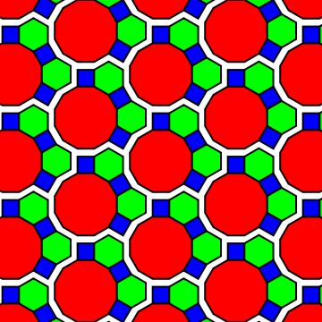
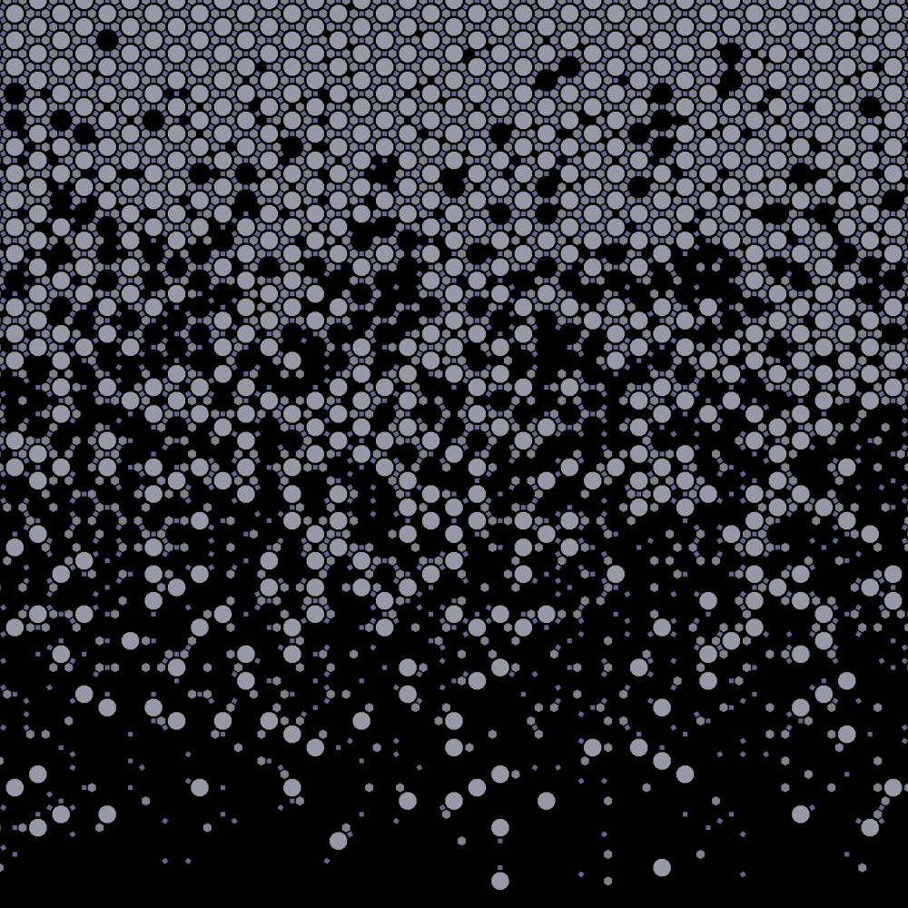

Exploded Tiling
===

This is just to store the code I used to generate some tiling background images.
TODO: Move the code from a .nb to .m or .wl files, include more tilings, more coloring styles.

Basic unit cell:

Tiling pattern falling off to zero density:

